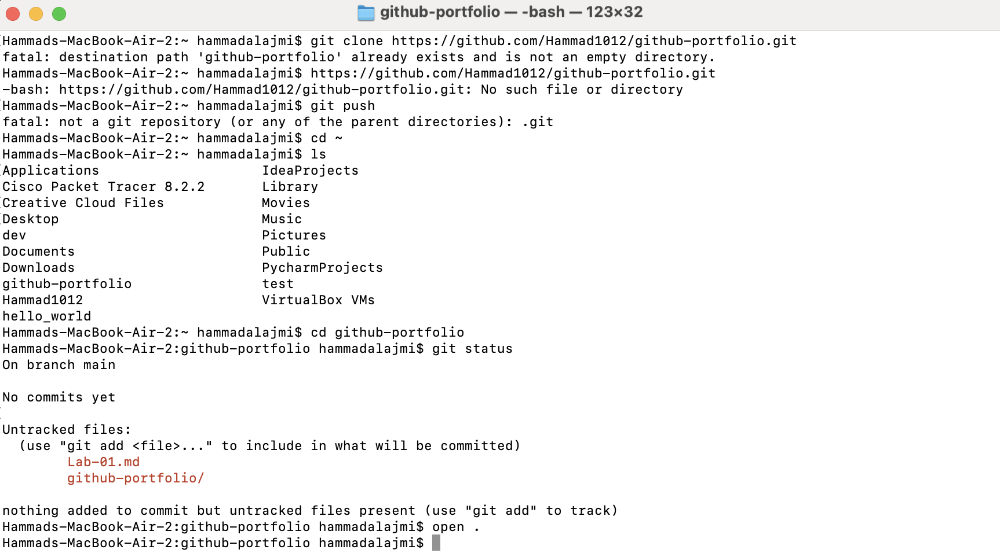

# Lab 01: Infrastructure Audit
**Name:** Hammad Alajmi
**Date:** 01/02/2026
**Status:** Completed

## 🎯 Objective
To document the 2021 Facebook outage and practice using GitHub for enterprise documentation.

## 🔍 Key Findings (Case Study)
1.  **The Event:** Facebook (Meta) disappeared from the internet because of a configuration error.
2.  **The Technical Cause:** A bad command deleted the BGP (Border Gateway Protocol) routes.
3.  **The Impact:** DNS resolvers could not find Facebook's servers.

## 📸 Proof of Work

## Forked Repositories

### 1. Penetration Testing Methodology
**Original Repo:** https://github.com/botesjuan/PenTestMethodology  
**Author:** @botesjuan  

- **Description:** A comprehensive reference of penetration testing techniques, commands, and methodologies covering reconnaissance, enumeration, exploitation, Active Directory attacks, and post exploitation.
- **Relevance:** This repository is directly relevant to IT-520 because it helps me understand real-world attack techniques so I can better design secure systems and identify vulnerabilities in business environments.

---

### 2. CyberChef
**Original Repo:** https://github.com/gchq/CyberChef  
**Author:** @gchq  

- **Description:** A web based tool known as the “Cyber Swiss Army Knife” that allows analysts to perform encoding, decoding, encryption, decryption, hashing, and data analysis operations directly in the browser.
- **Relevance:** CyberChef is widely used in cybersecurity and digital forensics. It supports my learning goals by helping me analyze and transform data without complex scripts, which is valuable for incident response and security investigations.
